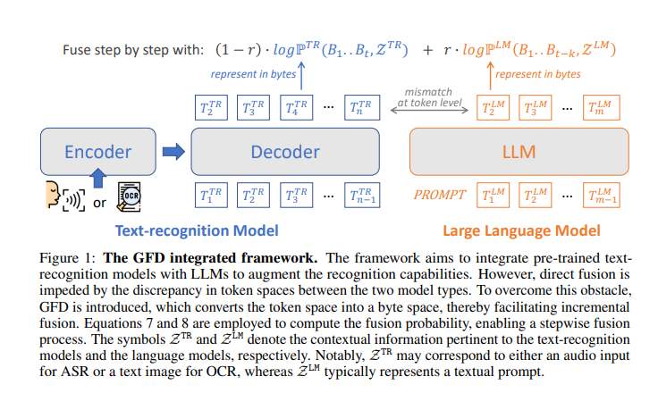

# Generative Fusion Decoding

Python code for the paper "[Let’s Fuse Step by Step: A Generative Fusion Decoding Algorithm with LLMs for Multi-modal Text Recognition](https://arxiv.org/abs/2405.14259)" by Chan-Jan Hsu*, [Yi-Chang Chen](https://ycc.idv.tw/about-me)*, Feng-Ting Liao, Pei-Chen Ho, Yu-Hsiang Wang, Po-Chun Hsu, Da-shan Shiu

 *Equal contribution


## Approach



We introduce "Generative Fusion Decoding" (GFD), a novel shallow fusion framework, utilized to integrate Large Language Models (LLMs) into multi-modal text recognition systems such as automatic speech recognition (ASR) and optical character recognition (OCR). We derive the formulas necessary to enable GFD to operate across mismatched token spaces of different models by mapping text token space to byte token space, enabling seamless fusion during the decoding process. The framework is plug-and-play, compatible with various auto-regressive models, and does not require re-training for feature alignment, thus overcoming limitations of previous fusion techniques. We highlight three main advantages of GFD: First, by simplifying the complexity of aligning different model sample spaces, GFD allows LLMs to correct errors in tandem with the recognition model, reducing computation latencies. Second, the in-context learning ability of LLMs is fully capitalized by GFD, increasing robustness in long-form speech recognition and instruction aware speech recognition. Third, GFD enables fusing recognition models deficient in Chinese text recognition with LLMs extensively trained on Chinese. Our evaluation demonstrates that GFD significantly improves performance in ASR and OCR tasks, with ASR reaching state-of-the-art in the NTUML2021 benchmark. GFD provides a significant step forward in model integration, offering a unified solution that could be widely applicable to leveraging existing pre-trained models through step by step fusion.

## Setup

1. **Clone the repository:**
   ```
   git clone https://github.com/mtkresearch/generative-fusion-decoding.git
   cd generative-fusion-decoding
   ```
2. **Create a python virtual environment:**
   ```
   python -m venv venv
   source venv/bin/activate  # On Windows use `venv\Scripts\activate`
   ```
3. **Install the required package:**
   ```
   pip install -r requirements.txt
   ```
4. **Run the setup script:**
   ```
   python setup.py install
   ```

## Run GFD
### GPU Memory Requirements
We run GFD on 1*A6000 machine

Memory Breakdown: ASR - Whisper Large ~3GB, LLM - Breeze/Mistral ~14GB

🤗You can try it out hassle-free with Kaggle T4 GPUs [here](https://www.kaggle.com/code/a24998667/generative-fusion-decoding-example)!

### On Single File
To run the script, the following three arguments are required: 
- `--model_name`: This argument specifies which type of model to use. There are two options:
    + `gfd`: The generative fusion decoding method.
- `--setting`: The argument specifies the configuration setting for the model. The available settings depend on the `model_name`:
    + `asr-zhtw`: The complete version of our method's configuration for testing on a Traditional Chinese sample.
    + `asr-zhtw-lmoff`: Uses our custom beam search method on the ASR model, neglecting the output from the LLM (fusing_r = 0) for a Traditional Chinese sample.
    + `asr-en`: The complete version of our method's configuration for testing on an English sample.
    + `asr-en-lmoff`: Uses our custom beam search method on the ASR model, neglecting the output from the LLM (fusing_r = 0) for an English dataset sample.
- `--audio_file_path`: The path to the audio file that you want to process.
- `--result_output_path`: The path where the output result will be saved.

**Example Usage**
```
python benchmarks/run_single_file.py --model_name gfd --setting asr-zhtw --audio_file_path demo_examples/zh_news.wav --result_output_path output.txt
```

For OCR inference you can use:
```
python benchmarks/run_ocr_single_file.py --image_file_path path/to/image.png --result_output_path output.txt
```

### OCR Benchmark Datasets
Common English OCR datasets such as `iiit5k`, `svt`, `icdar2013`, and `iam` can be evaluated using:
```
python benchmarks/run_ocr_benchmark.py --dataset_name iiit5k --output_dir ocr_result/
```
The script accepts any dataset identifier from the Hugging Face Hub and assumes `image` and `text` columns. Use `--image_column_name` or `--text_column_name` to override.

### On Benchmark Dataset
To run the benchmark dataset, the following four arguments are required:
- `--dataset_name`: Each dataset we tested has a short version name for easy reference. When you run  `benchmarks/run_benchmark.py`, the script will automatically download the specified dataset from Hugging Face. Below is a list of short version names of datasets used.
    + ml-lecture-long-2021: A dataset of long-form audio recordings from NTU 2021 machine learning lectures.
    + formosa-long: A dataset of long-form audio recordings in Traditional Chinese.
    + fleurs-hk: The Google Fleurs dataset using the split of yue_hant_hk.
    + noisy-librispeech-10: Librispeech dataset with noises added to the audio (S/R = 10).
    + noisy-librispeech-5: Librispeech dataset with noises added to the audio (S/R = 5).
    + atco2: Air Traffic Control Voice Communication dataset.  
- `--model_name`: This argument specifies which type of model to use. There are two options:
    + `gfd`: The generative fusion decoding method.
    + `whisper`: The huggingface whisper generation method.
- `--setting`: The argument specifies the configuration setting for the model. The available settings depend on the `model_name`:

   For **gfd**:
   + `asr-zhtw`: The complete version of our method's configuration for testing on the Traditional Chinese dataset.
   + `asr-zhtw-lmoff`: Uses our custom beam search method on the ASR model, neglecting the output from the LLM (fusing_r = 0) for Traditional Chinese dataset.
   + `asr-en`: he complete version of our method's configuration for testing on the English dataset.
   + `asr-en-lmoff`: Uses our custom beam search method on the ASR model, neglecting the output from the LLM (fusing_r = 0) for the English dataset.

   For **whisper**:
   + `whisper-zhtw`: The configuration for the Traditional Chinese dataset.
   + `whisper-en`: The configuration for the English dataset.

- `--output_dir`: The argument specifies the path to the directory where the model output will be stored. The outputs of the model will be stored in two subfolders:
    + `temp_results`: Stores the result of each sample to a JSON file.
    + `ds_result`: Stores the whole dataset along with the model predictions.

**Example Usage**

Here are some example commands for different configuration:
+ Using `gfd` model with `asr-zhtw` setting on `ml-lecture-2021-long` dataset
```
python benchmarks/run_benchmark.py --dataset_name ml-lecture-2021-long --model_name gfd --setting asr-zhtw --output_dir result/
```
+ Using `whisper` model with `whisper-zhtw` setting on `ml-lecture-2021-long` dataset
```
python benchmarks/run_benchmark.py --dataset_name ml-lecture-2021-long --model_name whisper --setting whisper-zhtw --output_dir result/
```
**Using Multiple GPUs**

If you have multiple GPUs, you can change the device configuration in the config file.

## Configuration

There are configurations for GFD and Whisper model under `config_files/model`, including Traditional Chinese and English for both models.
- GFD:
   - Traditional Chinese: `gfd-asr-zhtw.yaml`
   - English: `gfd-asr-en.yaml`
- Whisper:
   - Traditional Chinese: `whisper-zhtw.yaml`
   - English: `whisper-en.yaml`

In `config_files/prompt`, it also includes task-specific configurations of Automatic Speech Recognition (ASR) and Language Model (LLM) prompts for `gfd`. The naming rule for prompt configuration file is `{short version dataset name}_prompt.yaml`.

The general configuration files `gfd-asr-zhtw.yaml` and `gfd-asr-en.yaml` contain various configuration options. Below are the meanings and choices for each argument, divided into three parts based on the likelihood of needing to reset them.

### Core Arguments

- **`asr_model_path`**: Path to the Automatic Speech Recognition (ASR) model for speech recognition.

- **`llm_model_path`**: Path to the Language Model (LLM) for language processing task.

- **`lang`**: Language code for the ASR model, 'en' for English and 'zh' for Chinese.

- **`asr_device`**: Device to run the ASR model on.

- **`llm_device`**: Device to run the LLM on.

### Arguments that can optionally be reset

- **`force_character_mode`**: Output mode of characters when `lang == 'zh'`, options include `'tc'` for traditional Chinese characters, `'sc'` for simplified Chinese characters and `None` for no specific mode specified

- **`seg_with_overlap`**: Default is `False`. When set to `True`, the audio will be segmented with a short interval of overlap. If set to `false`, the audio will be segmented without any overlap.

- **`fusing_strategy`**: Default is `simple`. The fusing score of ASR and LLM will be the weighted sum of ASR score and LLM score. score = `fusing_r` * `llm_score` + `1-fusing_r` * `asr_score`.

- **`use_cache`**: Default is `dynamic`. When set to `dynamic`, the model will run with key-value (kv) cache enabled, which speeds up the processing, especially for long-from audio. If set to `None`, the kv cache will be disabled. If you are facing memory issues, consider setting it to `None` to release memory.

- **`fusing_r`**: Fusing ratio used in the fusing strategy to combine ASR and LLM outputs.

- **`asr_attn_implementation`**: ASR attention implementation, options including "eager" (manual implementation of the attention), "sdpa" (attention using torch.nn.functional.scaled_dot_product_attention), or "flash_attention_2" (attention using Dao-AILab/flash-attention). By default, if available, SDPA will be used for torch>=2.1.1. The default is otherwise the manual "eager" implementation.

- **`llm_attn_implementation`**: LLM attention implementation, options including "eager" (manual implementation of the attention), "sdpa" (attention using torch.nn.functional.scaled_dot_product_attention), or "flash_attention_2" (attention using Dao-AILab/flash-attention). By default, if available, SDPA will be used for torch>=2.1.1. The default is otherwise the manual "eager" implementation.

- **`llm_temp`**: LLM temperature parameter to modulate the next token probabilities.

- **`transcription_cutoff`**: Transcription cutoff limit. This argument specified the maximum number of tokens to retain from the previous transcription. If the previous transcription exceeds this limit, it will be truncated to the specified length.

### Arguments that most likely don't need to be reset

- **`repetition_penalty`**: The penalty applied to repeated tokens during the generation process. A higher value increases the penalty, making the model less likely to repeat the same tokens. If the `repetition_penalty` is greater than the `repetition_penalty_threshold`, the penalty is applied.

- **`repetition_penalty_last`**: Repetition penalty for the last tokens, which specifies the number of last tokens to apply the repetition penalty to.

- **`repetition_penalty_window`**: The window size for applying the repetition penalty. The penalty is applied to tokens within this window size from the current token being processed. For example, if `repetition_penalty_window` is set to `50`, the penalty will be applied to tokens within the last 50 tokens from the current token.

- **`repetition_penalty_threshold`**: The threshold for applying the repetition penalty. If the `repetition_penalty` is greater than this threshold, the penalty mechanism is activated.

- **`beam_terminated_strategy`**: Beam search termination strategy. The default is `when_all_ended`, which terminates beam search when all beams reaches the end.

- **`beam_select_strategy`**: Beam selection strategy, options including `'best'` which selects the beam with highest score, and `'longest'` which selects the beam with longest transcription result

- **`beam_max_decode_len`**: Maximum decode length for beam search, which specifies the maximum length of the decoded sequence during beam search.

- **`beam_max_len_diff`**: Maximum length difference for beam search, which specifies the maximum difference in length between the beams during beam search.

- **`beam_max_len`**: Maximum length for beam search, which specifies the maximum length of the beam search. A default value of `-1` means no limit.

- **`beam_min_len`**: Minimum length for beam search.

- **`logprob_min`**: Minimum log probability for the LLM output.

## Evaluate the Result

After running the model on the benchmark dataset, you can evaluate the result by calculating the Mixed Error Rates (MER) using the provided `benchmarks/calculate_mer.py` script. The script requireds the following arguments:

+ `--dataset_name`: The short version name of the benchmark dataset that you want to evalute.
+ `--output_dir`: The output directory that stores the output from the model.

**Example Usage**

```
python benchmarks/calculate_mer.py --dataset_name ml-lecture-2021-long --output_dir result/
```

## Evaluation Results on Benchmark Datasets
The table below shows the comparison of each method on multiple datasets: 

| Dataset |  GFD  | GFD Ablation* | Whisper(5beams) |
| :---:   | :---: | :---: | :---: | 
| NTUML2021-long| **6.05** | 6.09 | 9.56 |
| FormosaSpeech-long | **20.37** |  22.35 | 23.78 |
| Fleurs-HK | **5.91**  |  7.06 | 6.87 |
| Librispeech-Noise (S/R = 10) | **5.07** | 5.33 | 5.16 |
| Librispeech-Noise (S/R = 5) | **7.09** | 7.37 | 7.28 |

*In this setting, we set `fusing_r = 0`, which corresponds to running whisper with our custom beam search algorithm. Both **GFD Ablation** and **Whisper** are baselines of GFD.

| Dataset |  GFD  | GFD  |GFD Ablation | GFD Ablation | 
| :---:   | :---:   | :---: | :---: | :---: | 
|**ASR prompting** | **yes** | **no** | **yes** | **no** | 
|**LLM prompting** |  **yes** | **yes** | **NA** | **NA** | 
| ATCO-2 | - | - | 31.48 / 42.68** | - | - |


** The former score is computed using the results processed with Whisper EnglishTextNormalizer. The latter score is derived from transcription results that are only converted to lowercase without further normalization They correspond to the Norm and Raw column in the paper respectively.

## Warning

**Warning**: This project uses tokenizers with [custom tokenizer functions](https://github.com/mtkresearch/generative-fusion-decoding/blob/main/gfd/tokenizer.py) mostly to deal with byte string tokenizations, and has only been tested with the Mistral and Breeze models. Using other models may result in errors or unexpected behavior. Please ensure compatibility before using it with other models.

## Acknowledgements
If you like our work, please site:
```
@article{hsu2024let,
   title={Let's Fuse Step by Step: A Generative Fusion Decoding Algorithm with LLMs for Multi-modal Text Recognition},
   author={Hsu, Chan-Jan and Chen, Yi-Chang and Liao, Feng-Ting and Ho, Pei-Chen and Wang, Yu-Hsiang and Hsu, Po-Chun and Shiu, Da-Shan},
   journal={arXiv preprint arXiv:2405.14259},
   year={2024}
}
```
